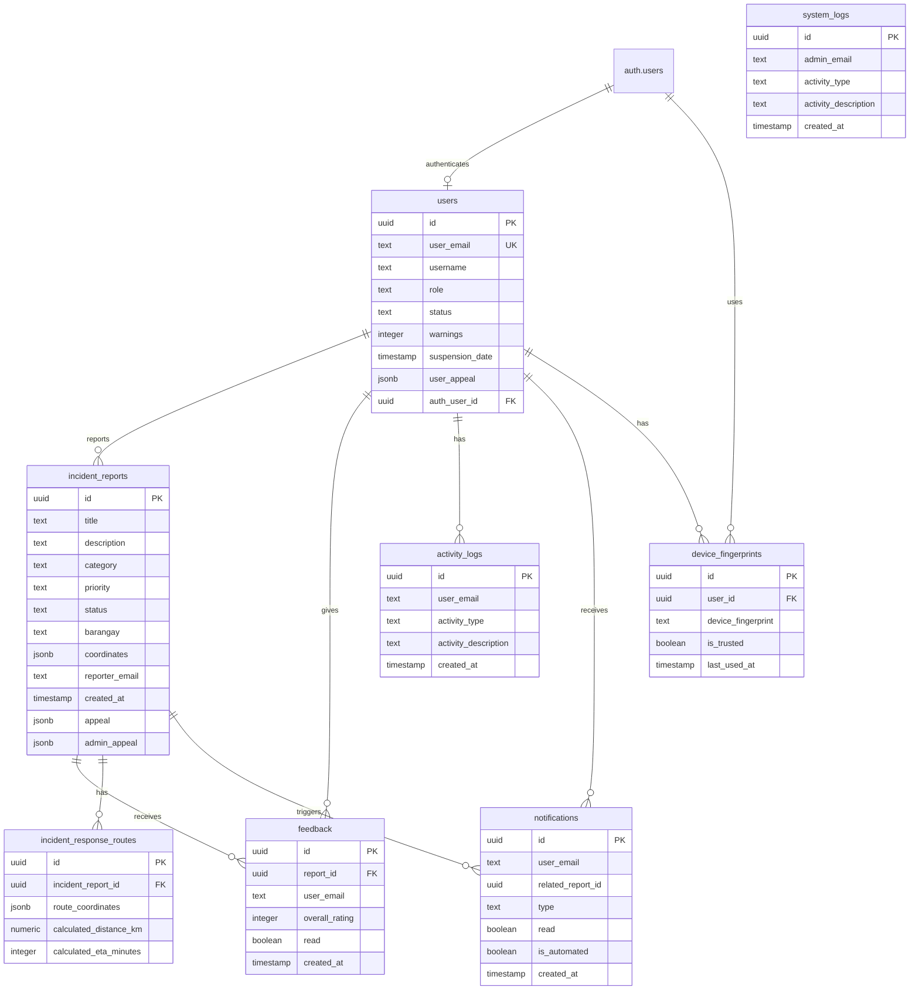

# iAMUMA ta Database ERD

## Entity Relationship Diagram

## Table Summary

### Core Tables

**users**
- **PK**: `id`
- **FK**: `auth_user_id` → `auth.users(id)`
- **Important**: `user_email` (unique), `role`, `status`, `warnings`, `suspension_date`, `user_appeal`

**incident_reports**
- **PK**: `id`
- **Important**: `title`, `description`, `category`, `priority`, `status`, `barangay`, `coordinates`, `reporter_email`, `appeal`, `admin_appeal`

**feedback**
- **PK**: `id`
- **FK**: `report_id` → `incident_reports(id)`
- **Important**: `user_email`, `overall_rating`, `read`

**incident_response_routes**
- **PK**: `id`
- **FK**: `incident_report_id` → `incident_reports(id)`
- **Important**: `route_coordinates`, `calculated_distance_km`, `calculated_eta_minutes`

**notifications**
- **PK**: `id`
- **Important**: `user_email`, `related_report_id`, `type`, `read`, `is_automated`

**activity_logs**
- **PK**: `id`
- **Important**: `user_email`, `activity_type`, `activity_description`

**system_logs**
- **PK**: `id`
- **Important**: `admin_email`, `activity_type`, `activity_description`

**device_fingerprints**
- **PK**: `id`
- **FK**: `user_id` → `auth.users(id)`
- **Important**: `device_fingerprint`, `is_trusted`

## Relationships

1. **users** → **incident_reports** (One-to-Many)
   - Users can create multiple incident reports
   - Linked via `reporter_email`

2. **users** → **feedback** (One-to-Many)
   - Users can provide multiple feedback entries
   - Linked via `user_email`

3. **incident_reports** → **feedback** (One-to-Many)
   - Each report can receive multiple feedback entries
   - Linked via `report_id` FK

4. **incident_reports** → **incident_response_routes** (One-to-Many)
   - Each report can have multiple route calculations
   - Linked via `incident_report_id` FK

5. **users** → **notifications** (One-to-Many)
   - Users receive multiple notifications
   - Linked via `user_email`

6. **users** → **activity_logs** (One-to-Many)
   - Users have multiple activity log entries
   - Linked via `user_email`

7. **users** → **device_fingerprints** (One-to-Many)
   - Users can have multiple device fingerprints
   - Linked via `user_id` FK → `auth.users(id)`

8. **auth.users** → **users** (One-to-One)
   - Each auth user has one user profile
   - Linked via `auth_user_id` FK

